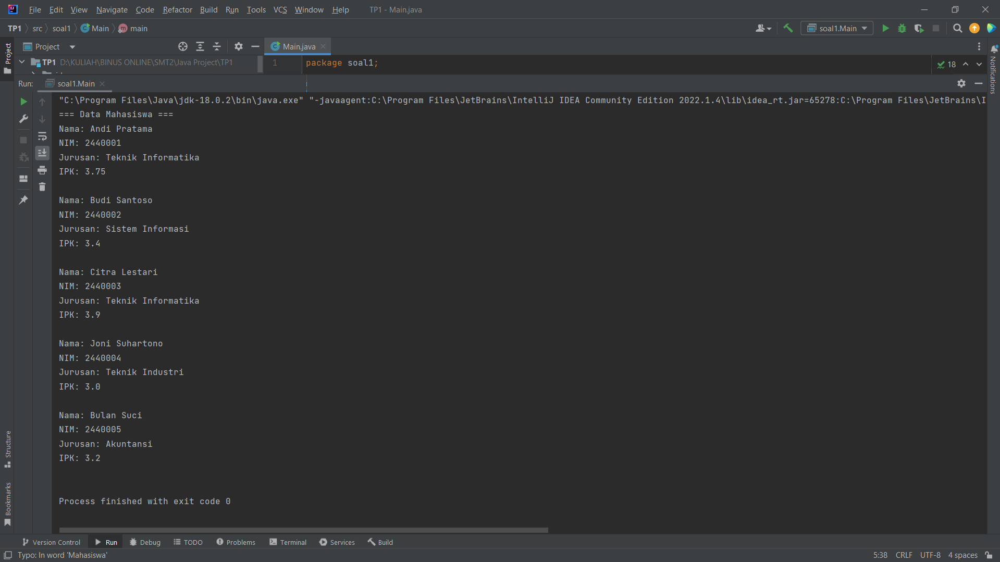
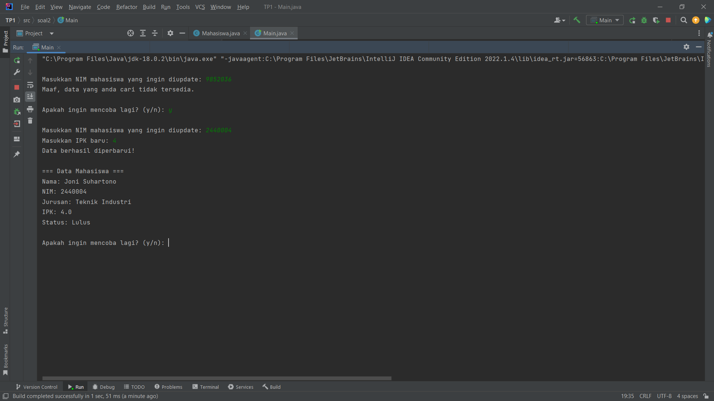
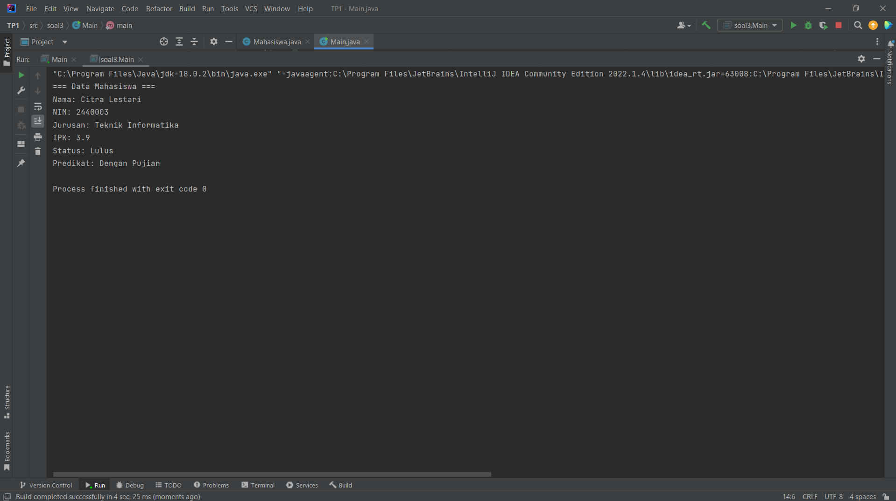

**Nama:** Muhammad Akbar Felda  
**NIM:** 2902702656

---

# Soal 1 – Pembuatan Class dan Object

### ✅ Fitur:
- Membuat class `Mahasiswa`
- Memiliki atribut: nama, nim, jurusan, ipk
- Constructor untuk inisialisasi data
- Method `showInfo()`
- Menyimpan 5 objek dalam array
- Menampilkan seluruh data menggunakan loop

### 📷 Hasil Eksekusi:

---

---

# 🔹 Soal 2 – Enkapsulasi dan Method

### ✅ Fitur:
- Atribut `ipk` dibuat `private`
- Menggunakan getter dan setter
- Method `checkApproval()`
- Method `updateIpk()`
- Input pengguna menggunakan `Scanner`
- Validasi pencarian NIM
- Looping agar user dapat mencoba ulang tanpa menjalankan ulang program

### 📷 Hasil Eksekusi:

---

# 🔹 Soal 3 – Predikat Akademik

### ✅ Fitur:
- Method `calculatePredicate()`
- Menentukan predikat berdasarkan rentang IPK:
  - ≥ 3.75 → Dengan Pujian
  - 3.50 – 3.74 → Sangat Memuaskan
  - 3.00 – 3.49 → Memuaskan
  - < 3.00 → Perlu Perbaikan
- Menampilkan status kelulusan dan predikat

### 📷 Hasil Eksekusi:

---
